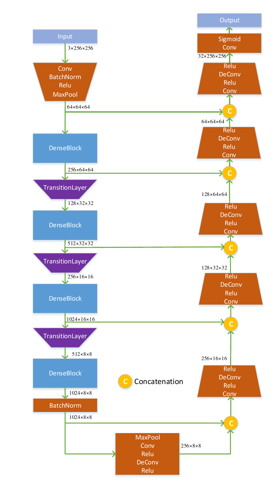
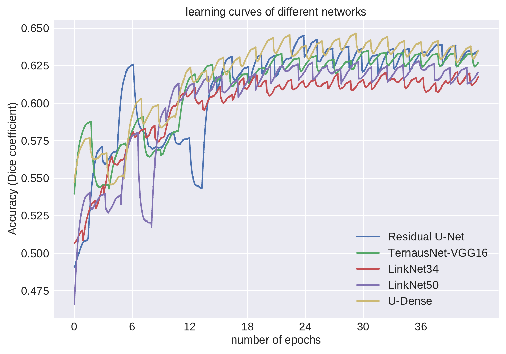
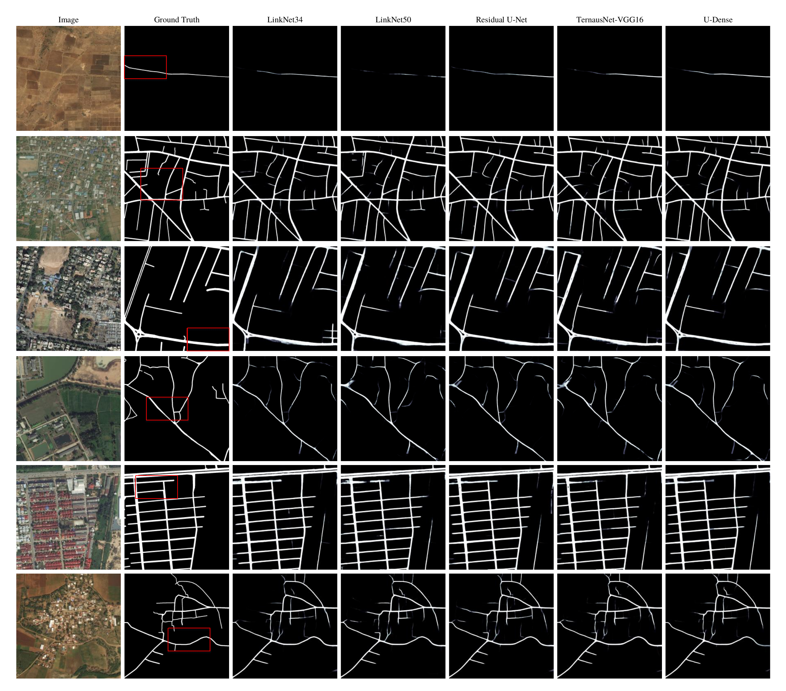

# Road Extraction based on U-Net architecture (CVPR2018 DeepGlobe Challenge submission)
---
Submission ID: [deepjoker](https://competitions.codalab.org/competitions/18467#results) (7th place during the validation phase before 1st May, 2018)

**Examples of detected roads**

## Architecture

One of the most prevalent architectures for binary semantic segmentation is U-Net, which fuses multi-level feature maps to hierarchically increase the spatial resolution of the output probability map. The encoder exploited in the original U-Net is built by plain neural units, while the feature representation capability of plain neural unit is overtaken by residual neural unit. More recently, a multi-layer dense block was proposed in DenseNet architecture, where each layer is connected to every other layer. Taking advantage of this type of connection, the forward feature propagation ability is strengthened, and the number of parameters can be reduced as the network going deeper. Inspired by this, we seek to investigate whether the U-Net encoders can be made of dense blocks and if an improvement of semantic segmentation can be achieved. To this end, as illustrated as follows, a U-Dense network is utilized. Its encoder part is mainly composed of four dense blocks and three transition layers, and the decoder part is constructed based on five plain neural units. To be specific, the dense block and transition layer are explained as follows. 

**Combination of DenseNet encoding block and U-Net architecture**

## Loss function

Given the input images $\mathbf{Y}_i$ and the associated ground truth maps $\mathbf{G}_i$, the joint loss function is exploited for learning networks, which combines pixel-wise binary cross entropy (BCE) loss and the Dice coefficient. In particular, the Dice coefficient is determined by the true positive (TP), false positive (FP), and false negative (FN) based on the prediction and ground truth, which can be written as :

$\mathrm{Dice}=\frac{2\mathrm{TP}}{2\mathrm{TP}+\mathrm{FP}+\mathrm{FN}}.$
	
Correspondingly, the joint loss function is formulated as:

$L=\frac{1}{N}\sum_{i=1}^{N}(\mathrm{BCE}(F(\mathbf{Y}_i),\mathbf{G}_i)+1-\mathrm{Dice}(F(\mathbf{Y}_i),\mathbf{G}_i))$

where $N$ is the number of images in a batch, and $F(\mathbf{Y}_i)$ represents the output probability map of the trained network, given the input image $\mathbf{Y}_i$. 

## Ensembling

Different from other kinds of images, remote sensing images always have large-scale spatial sizes; e.g., $2048\times2048$ pixels. It may be difficult to directly feed the batches of such images into networks due to the memory limitation of GPU. Therefore, image tiles with smaller spatial sizes are usually sampled from the original dataset to train networks. However, one may not know which parameter of the spatial size is the best for the final decision produced by networks. Furthermore, image tiles with different spatial sizes may capture contextual information at multiple scales. Therefore, a multi-scale model ensembling procedure is conducted based on the proposed U-Dense in this letter. In particular, U-Dense models are trained on image tiles with $256\times256$ and $512\times512$ pixels. The decision fusion is carried out by averaging the probability maps produced by the two models, and the binary segmentation can be obtained at a given threshold. The threshold is set at $0.5$.

## Training

**Learning curves of validation dataset**

**Comparison with other methods**

